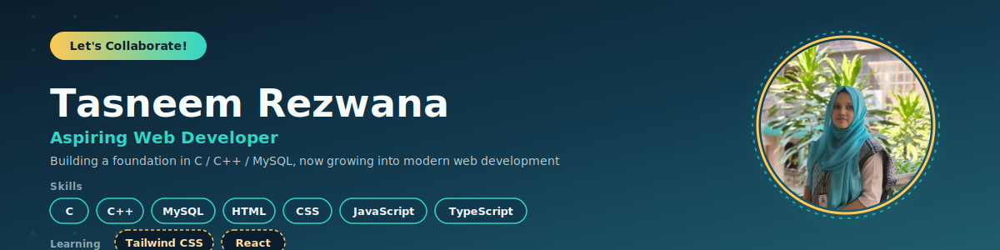

  

<h1 align="center">Hi 👋, I'm Tasneem Rezwana</h1>

<h3 align="center">A passionate frontend developer from Bangladesh</h3>

---

## 👩‍💻 About Me

I'm a CSE student passionate about programming and web development.  
I enjoy learning new technologies, solving problems, and building clean and user-friendly websites.

- 🌱 Currently learning **React & Tailwind CSS**
- 💻 Exploring **Web Development**
- 🧠 Improving my **problem-solving and programming skills**

---

## 🛠️ Skills

  

---

## 🔗 Connect with me

  
  
  

---

## 📊 GitHub Stats

  

  

  

